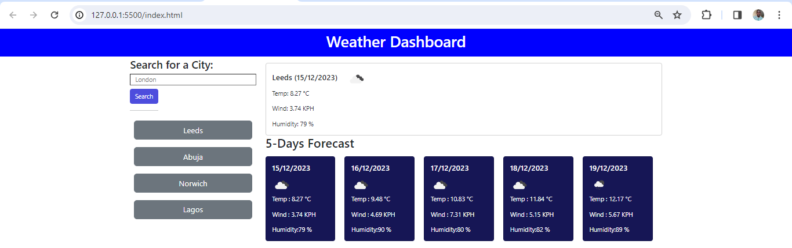

# Weather-Dashboard
## Description
The repository contains codes that allow users to see the weather forecast for cities of their choosing.The app uses openweathermap API to access weather data for a particular city and 5 day weather forecast.Application runs in the browser and feature dynamically updated HTML and CSS.Persistent data were stored in local storage for easy retrieval.

## Installation
N/A

## Usage

This is a browser application with a search input area to capture the city typed by the user. The click of the search button will fetch the data from openweathermap URL and return the current day weather information and 5 day eather forecast. 
 https:
 

## Credit
The starter code for this project was supplied by edX  bootcamp (https://bootcampspot.instructure.com/),while https://stackoverflow.com/ ,https://discuss.codecademy.com/ ,https://openweathermap.org/forecast5 among other websites broadened my knowledge on Application Programming interface usage and functionality.

## Lincence
N/A 